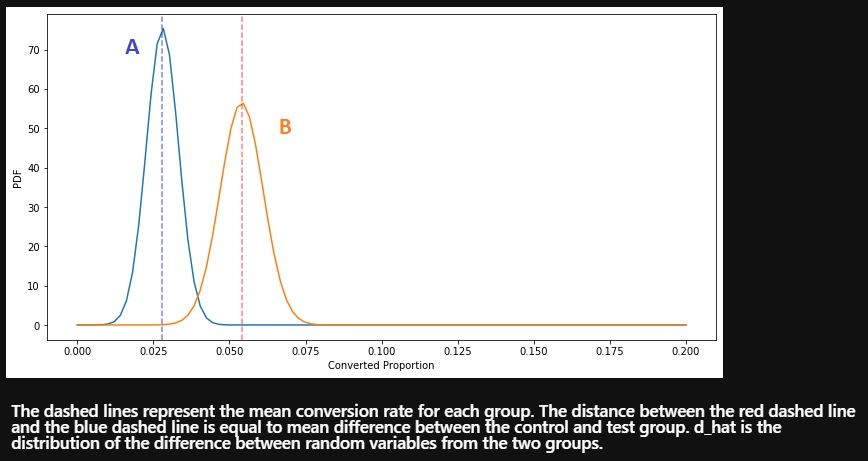
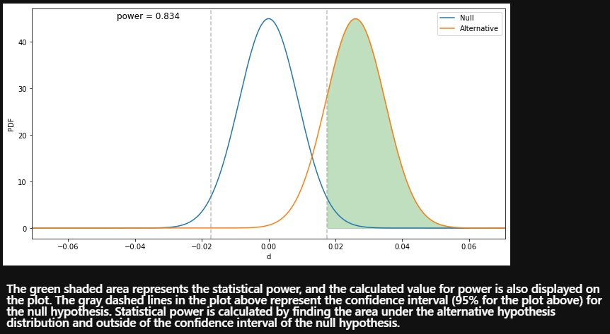

# AB_testing_framework_frequentist
 
This is an AB testing framework using the frequentist approach. Features included: 

 * Dataset Generator: usually we would just plug our data directly for AB testing 
 * Visualization of distributions: probability, z-scores and more 
 * Statistical Significance Calculator
 
 # Methodology
 I have included a step by step guide into the code with comments. And decided to not create modules so that it would read top to bottom
 
 # Intended purpose
 Serves as a "skeleton" framework for AB testing. All the built functions can be seen as assets that can even be distributed in production using modules
 
 # Assets Preview:
 
 
 
